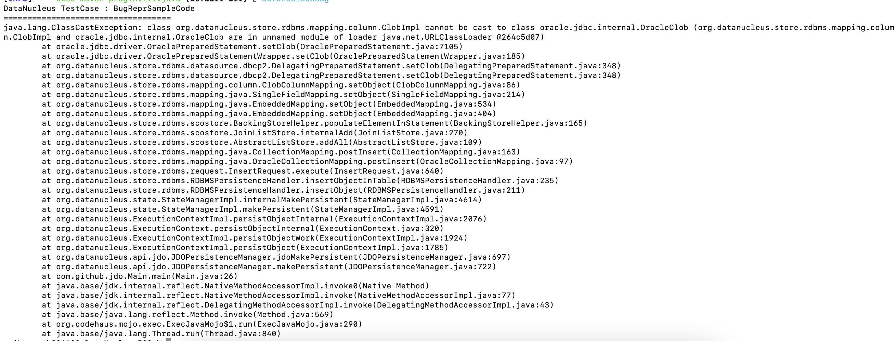
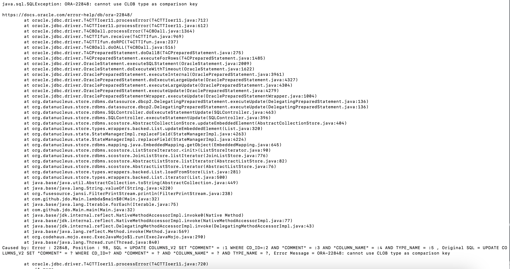

# Steps to repro CLOB column issues in ORACLE
## Issue 1: ClassCastException for CLOB Column
### Step 1: Compile the project
```bash
mvn clean install
```
### Step 2: Create schema in Oracle
```bash
mvn datanucleus:schema-create
```
### Step 3: To run the program and you'll see error linked below
```bash
mvn exec:java
```

## Issue 2: 
### Assuming you have run step 1-2 from above previously
### Step 3: Change package.jdo L#23 <column name="TYPE_NAME" length="3267" jdbc-type="VARCHAR" allows-null="false"/> and compile the project again
```bash
mvn clean install
```
### Step 4: To run the program and you'll see an error attached below of Issue-2
```bash
mvn exec:java
```

## Step miscellaneous: For schema creation and deletion
```bash
mvn datanucleus:schema-create
mvn datanucleus:schema-delete
```

# NOTE
<p>
The same code is working with datanucleus version 5.x
</p>

# Error StackTrace for Issue 1


# Error StackTrace for Issue 2


